# Intro
The Cloud Storage Engine (CSE), similar to TiKV, implements a multi-raft architecture. In a multi-raft system, persisting Raft logs is a critical operation: a write is committed only after a majority of nodes have persisted its log entry. In CSE, the component responsible for persisting Raft logs is `RfEngine`. `RfEngine` provides operations such as persisting new entries, reading a range of entries, and truncating old entries. This document describes its design in detail.

# Interface: WriteBatch

<figure style="text-align: center;">
  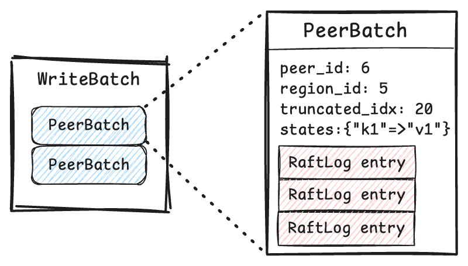
  <figcaption><em>RfEngine: WriteBatch</em></figcaption>
</figure>

RfEngine provides a `WriteBatch` interface for writes. A `WriteBatch` consists of multiple `PeerBatch` objects, each containing updates (such as new log entries) for a specific peer. Each peer belongs to one region.

# Persistence: WAL
When RfEngine receives a request to persist a `WriteBatch`, the changes are first applied in memory. It then follows a classic Write-Ahead Log (WAL) approach: once a `WriteBatch` is synchronously persisted to the WAL file on disk, the operation is considered complete and durable. If a failure occurs afterward, the in-memory states can be rebuilt from WAL.

The **WAL writer** performs writes to the WAL files. Each WAL file has a configurable size limit (default 512MB). When the current WAL file doesn't have enough space for the new WriteBatch, the writer rotates to the next file. Each rotation increments an epoch id, identifying the current version of the WAL.

<figure style="text-align: center;">
  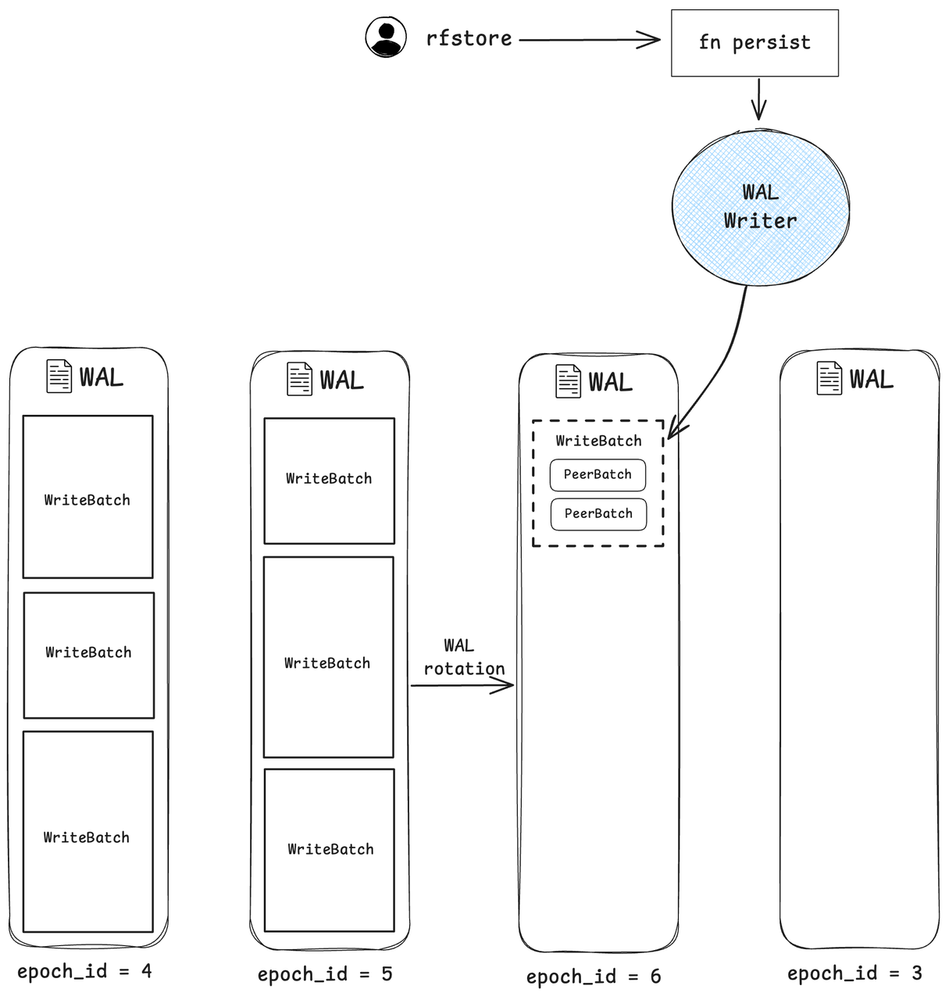
  <figcaption><em>RfEngine: WAL files</em></figcaption>
</figure>

**Reusing WAL files**: To reduce the overhead of file creation and directory syncing, there is a fixed number (4) of WAL files that are reused in a circular manner. After each rotation, the older WAL file are asynchronously compacted into per-region raft log files (described in the next section). Because a WAL file must be compacted before it can be reused, the speed of compaction limits the maximum write throughput.

**Write stall**: When the WAL writer attempts to rotate to a new WAL file, but the file is not ready due to slow compaction, writes will block until compaction completes on the new WAL file.

# WAL Compaction

<figure style="text-align: center;">
  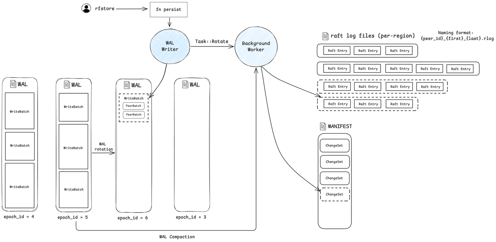
  <figcaption><em>RfEngine: WAL Compaction</em></figcaption>
</figure>

After a WAL file is rotated, the **background worker** starts the compaction process: it iterates through all `WriteBatch` entries in the WAL, groups entries by region, discards obsolete logs based on the truncate index, and generates per-region raft log files. After that, the worker synchronously writes a `ChangeSet` into the manifest file. The `ChangeSet` contains the newly created raft log files (`rlog`) and the epoch id of the WAL file that was compacted.

# Async WAL writer
The **async WAL writer** is an optimization in RfEngine designed to reduce write latency. It uses a dedicated WAL sync directory placed on a high-IOPS storage volume, since write latency heavily depends on the speed of WAL syncing. After synchronously persisting a write to the WAL sync directory, RfEngine sends the write task to the async WAL worker. It then immediately acknowledges completion to the caller without waiting for the async write to finish.

<figure style="text-align: center;">
  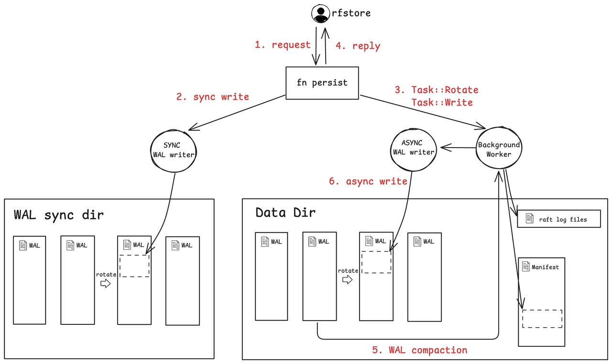
  <figcaption><em>RfEngine: Async WAL writer </em></figcaption>
</figure>

Thus, two copies of the WAL exist: the sync directory only handles writes (except during restarts), while the async directory supports reads such as compaction. During a restart, the async directory might lack some `WriteBatch` entries. RfEngine resolves this by scanning the sync WAL and sending any missing `WriteBatch` entries to the async WAL writer to restore consistency.

As a side note, WAL rotation is driven solely by the sync writer; when the sync writer rotates, it signals the async writer to rotate as well.

**Failure scenarios**:
- If the WAL writer (sync or async) fails to write to disk, it will result in a panic. Such failures are rare and typically only result from low-level hardware or I/O issues outside the application's control.
- If the async writer becomes slow or stuck, it will block the background worker that runs it. This in turn slows down compaction and may cause the sync writer to experience write stalls.

# On-disk formats

## WAL File
This section describes the layout of data within WAL files.

<figure style="text-align: center;">
  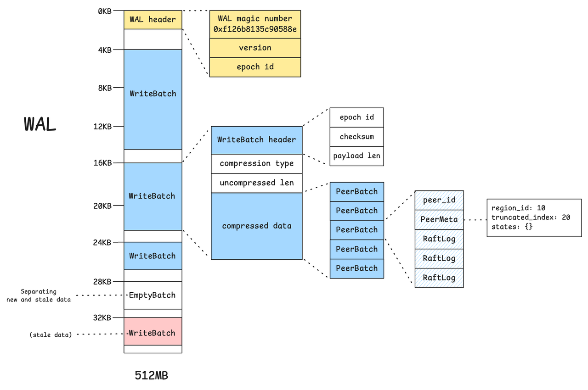
  <figcaption><em>RfEngine: WAL format </em></figcaption>
</figure>

Each WAL file begins with a 4KB header block containing metadata such as the WAL magic number, file format version, and epoch id. Each subsequent `WriteBatch` also starts at a 4KB-aligned offset to satisfy alignment requirements imposed by direct I/O operations.

When the serialized size of a `WriteBatch` exceeds a configurable threshold (default: 8KB), its payload is compressed using LZ4. Each `WriteBatch` contains multiple `PeerBatch` entries grouped by region, along with metadata including checksum and payload length.

WAL file data is never deleted—only overwritten. To separate fresh data from stale data, RfEngine inserts an empty batch (EmptyBatch) as a marker. This serves as a logical boundary, similar to an EOF marker, indicating the end of the most recent valid write batches.

## Manifest File

<figure style="text-align: center;">
  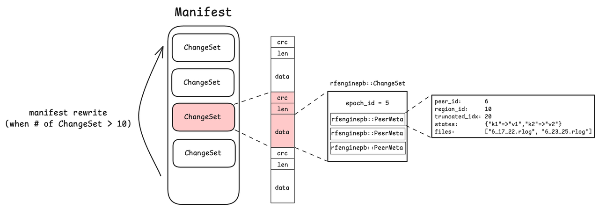
  <figcaption><em>RfEngine: Manifest format </em></figcaption>
</figure>

The manifest file contains a list of `ChangeSet` objects. Each successful WAL rotation produces a new `ChangeSet`, which records per-region metadata, including rlog file names, peer metadata, and the epoch id.

The manifest file holds at most 10 `ChangeSet` entries. Once this limit is exceeded, a rewrite occurs: RfEngine takes a snapshot of the in-memory state and writes it as a single new `ChangeSet` into a fresh manifest file, discarding the old manifest. This mechanism ensures that the manifest remains compact and easy to manage.

During a restart, RfEngine reconstructs its in-memory states with the information in the Manifest. It will identify which WAL files have been compacted and resume compaction for uncompated WAL files.

## Raft log file

<figure style="text-align: center;">
  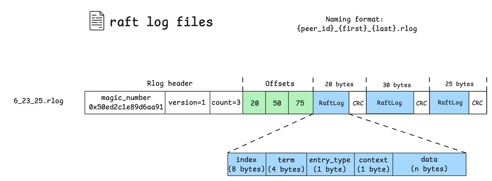
  <figcaption><em>RfEngine: Rlog file format </em></figcaption>
</figure>

Raft log files (.rlog) store log entries specific to a region. Each file begins with a header containing a magic number, file version, and the count of log entries. Immediately following the header is a sequence of offsets, each marking the end position of a log entry relative to the start of the entries section.

Each raft log entry contains metadata: the log's index, term, entry type, context, and data payload. Entries are stored sequentially, each followed by a CRC checksum for integrity verification.
File names follow the format `{peer_id}_{first}_{last}.rlog`, identifying the range of log indices stored in the file.

# Read Path
RfEngine maintains all state information in memory, including the manifest data and per-peer states with all raft log entries. This allows for efficient reads at the cost of increased memory usage. As discussed, all writes are first applied in memory and then persisted to disk. Upon restart, RfEngine reconstructs the entire in-memory state from the persisted data on disk.

# Log GC
A `WriteBatch` can specify a `truncated_idx` for each region, indicating that entries older than this index are no longer needed. During WAL compaction, obsolete log entries will not be put into the per-region raft log files. At the end of the compaction, outdated raft log files (.rlog) are deleted as well, freeing disk space.

# Backup and Restore (BR)
## Backup
Let's first define the concept of a **snapshot** to facilitate the discussion. At any point in time, the manifest and rlog files on disk form a snapshot for a specific epoch. This snapshot can fully restore the `rfengine` state up to that epoch. The only data not included is what remains in the uncompacted WALs. A backup thus involves uploading a snapshot (manifest + rlog files) together with any write batches in the uncompacted WALs.

<figure style="text-align: center;">
  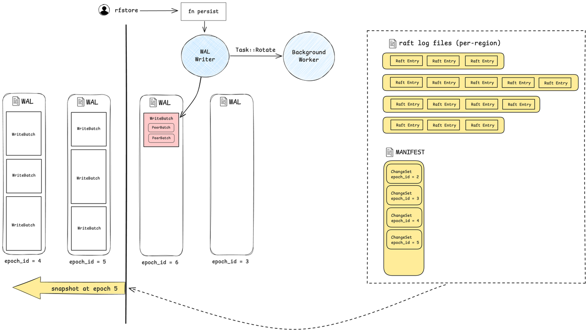
  <figcaption><em>RfEngine: Snapshot </em></figcaption>
</figure>

Different types of backups:
1. **Full backup**: Upon request, back up a snapshot and the uncompacted WALs. This captures the complete rfengine state at that point, as described above.
2. **Incremental backup**: Upon request, back up the WAL file delta since the last full/incremental backup. This only works if the WAL hasn’t rotated since the last full backup, which limits its usefulness in write-heavy scenarios.

    <figure style="text-align: center;">
        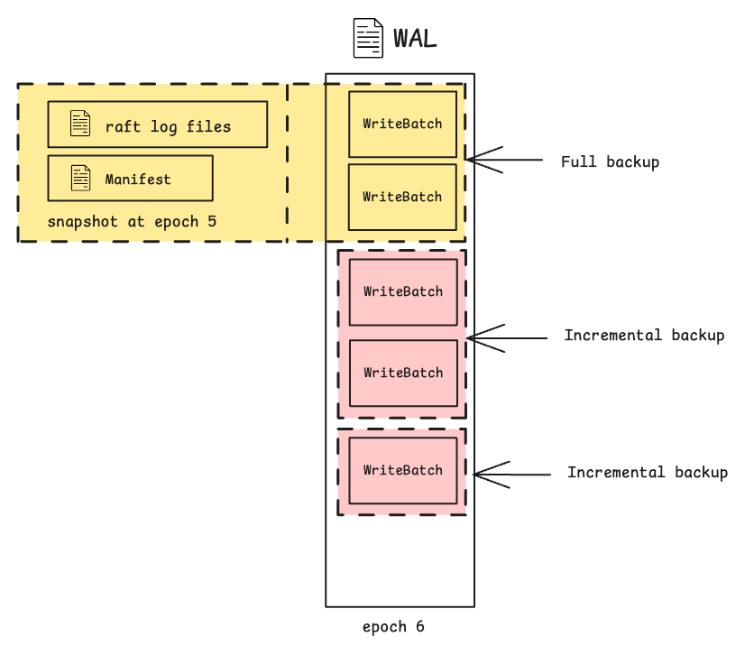
        <figcaption><em>RfEngine: Full backup and incremental backup </em></figcaption>
    </figure>

3. **Lightweight backup**: In this mode, all WAL files are continuously uploaded to S3, and snapshots are taken periodically (every 4 WAL files) as part of normal operation. When a backup is requested, it simply records the current WAL epoch and offset. During restore, the system will locate the latest snapshot before the backup point and replay WAL chunks from the snapshot to the backup point.

    <figure style="text-align: center;">
        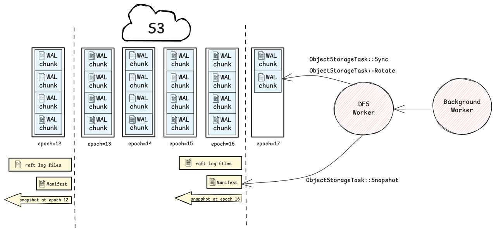
        <figcaption><em>RfEngine: Lightweight Backup </em></figcaption>
    </figure>

  - **DFS worker**
    - The DFS worker is responsible for syncing WAL data and uploading snapshots to S3. For each new write batch, it accumulates WAL changes in memory and flushes them to S3 in 64MB chunks or immediately upon WAL rotation.
  - **Failure scenarios**:
    - **S3 unavailability**: When the DFS worker fails to upload to S3, it enters an unhealthy state and stops uploading WAL chunks. Lightweight backups are unavailable during this period. At the next snapshot point, it will attempt to upload the snapshot. If successful, it exits the unhealthy state and resumes uploading WAL chunks.
    - **Crash**: If the system crashes after completing a lightweight backup, the DFS worker may still have WAL data in memory that hasn't been uploaded to S3. As a result, the backup stored in S3 may be incomplete and insufficient for restore. The current workaround is to retrieve the missing data directly from the store, as described in `lightweight_native_br.md`:
        > It's important to note that WAL chunks are uploaded asynchronously, so during restoration, the last WAL chunk might not have been uploaded to S3 yet. In such cases, the missing data is directly retrieved from the store through HTTP API and replayed into the rfengine.

## S3 file formats
For each CSE store, rlog files are concatenated into a single object before uploading to S3. Since S3 has a 5GB limit per object, the backup will fail if this size is exceeded — though this should rarely happen in practice. A `StoreRaftLogBackupMeta` is appended at the end to describe the contents of the rlog object, and its starting offset is recorded in `StoreBackupMeta`.

<figure style="text-align: center;">
    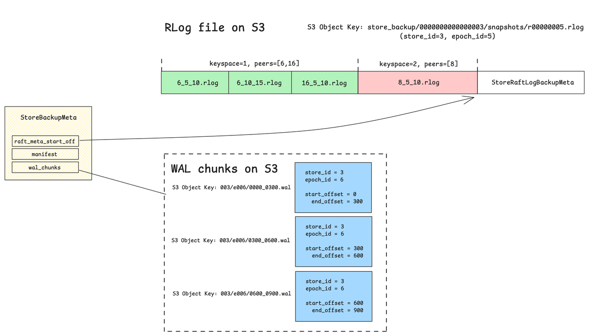
    <figcaption><em>RfEngine: Backup Files on S3 </em></figcaption>
</figure>

The `StoreBackupMeta` information from all stores is aggregated by the cloud worker into a single `ClusterBackupMeta`, which is then uploaded to S3. The cloud worker is the component responsible for coordinating the cluster-level backup process. For example, it sends a `/rfengine/backup` request to each store to trigger the backup.

<figure style="text-align: center;">
    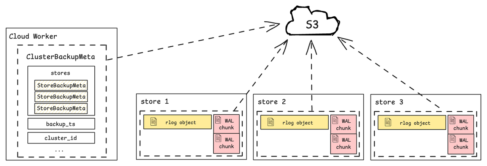
    <figcaption><em>RfEngine: ClusterBackupMeta </em></figcaption>
</figure>

## Restore
Restoring an rfengine from a backup is much like what happens during a restart — it recovers from its persisted state on disk. The process mainly involves downloading files from S3 and reconstructing them into the expected on-disk format. During restore, the rfengine bootstraps from a snapshot (manifest and rlog files) and replays WAL chunks up to the backup point. Once complete, the rfengine is restored to the exact state it was in when the backup was taken.

**The Read Amplification Challenge**

<figure style="text-align: center;">
    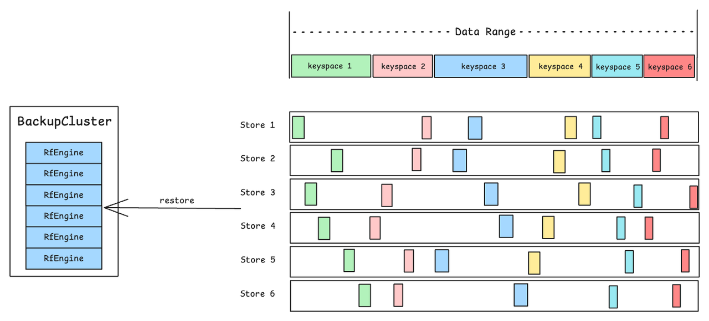
    <figcaption><em>RfEngine: Keyspace Restore </em></figcaption>
</figure>

CSE is designed for multi-tenancy, where each tenant owns a keyspace — a contiguous data range typically spanning multiple regions across different stores. To restore a single keyspace, the current implementation sets up a backup cluster from the backup and extracts keyspace-relevant data. This requires fully restoring all rfengines across all stores, downloading all relevant manifest and WAL files. As a result, there could be significant read amplification: data for all keyspaces is read even though only a small subset is needed. This happens because manifest and WAL files mix data from all keyspaces.

Keyspace restore may be relatively infrequent, so the impact of read amplification could be acceptable in practice. One possible mitigation is to add a post-processing step that splits the backup files on S3 by keyspace. This would make per-keyspace restore more lightweight, but at the cost of increased overhead during backup.